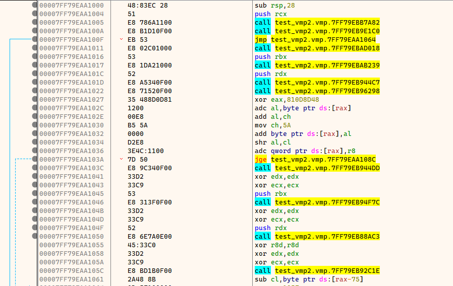
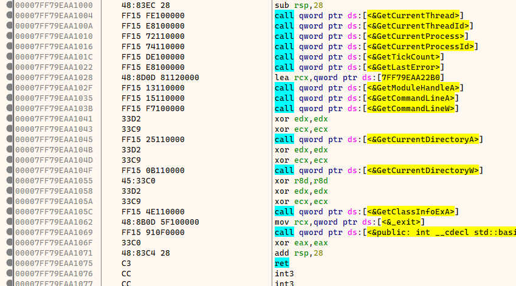
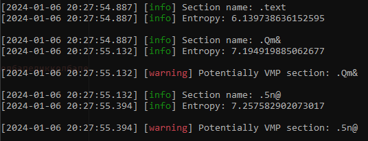

# VMP-Import-Deobfuscator

VMP-Import-Deobfuscator is a program that allows you to deobfuscate imports, it rebuilds IAT and then patches all obfuscated calls, all you have to do is dump the program itself (Supports only x64).

This project is based on this repository, thanks to the author: https://github.com/woxihuannisja/vmp3-import-fix

Tested on versions: 3.1, 3.5, 3.6, 3.7, 3.8.3, 3.8.4, 3.8.5, 3.8.6.


## Before
 

## After


## Usage
```bash
-p: required.
Usage: VMP-Imports-Deobfuscator [options]

Optional arguments:
-h --help       shows help message and exits
-v --version    prints version information and exits
-p --pid        Target process name [required]
-m --module     Target module name [default: ""]
-i --iat        Section that is used to storage new IAT, it maybe destroy vmp code [default: ".rdata"]
```

Example usage:
```
VMP-Imports-Deobfuscator.exe -p 3135
VMP-Imports-Deobfuscator.exe -p 3135 -m "sample.dll"
VMP-Imports-Deobfuscator.exe -p 3135 -m "sample.dll" -i ".sec0"
```

The user no longer needs to enter the names of all VMProtect sections, the program determines the partitions by the computed entropy. Secure VMProtect applications always have a partition entropy greater than 7.



## What about new VMProtect versions?

VMProtect versions higher than 3.7 started using several stubs. In the past, programs that fix VMProtect calls tried to fix calls by only getting as far as the first RET instruction. In the new versions, the number of stubs has increased. As a result, almost all programs became inoperable on new versions of VMProtect.

Example:
```perl
mov r15,qword ptr ss:[rsp+10]; First stub
push qword ptr ss:[rsp+48]
popfq 
mov rbp,qword ptr ss:[rsp+20]
lea rsp,qword ptr ss:[rsp+58]
ret ; There will be no import call, it will go to the next stub.

call 7FF79EBAA8D6; Second stub
call 7FF79EB8D041
lea rsp,qword ptr ss:[rsp+10]
ret ; Call import
```

## Credits
- github.com/woxihuannisja
- github.com/unicorn-engine/unicorn
- github.com/DarthTon/Blackbone
- github.com/archercreat/vmpfix
- github.com/zyantific/zydis


## TODO
- 32-bit support

